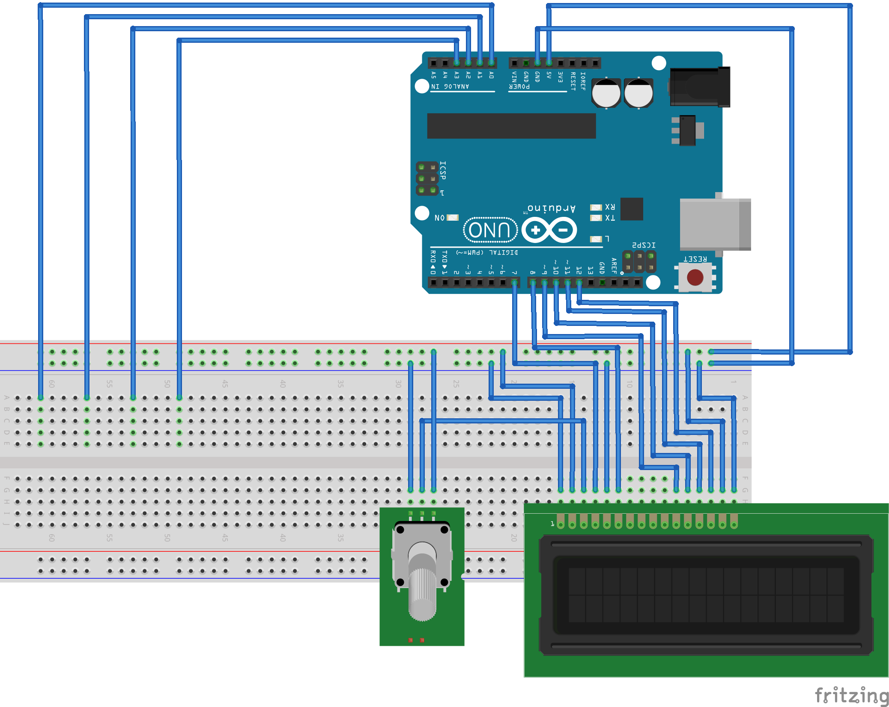

# Arduino Makeshift Voltmeter
The analog input pins of an Arduino are used to do crude voltage measurements within 5V systems.\
The values are then conveniently displayed to a 16x2 LCD screen and updated live.

## Details
Arduino systems have some analog pins, the Arduino Uno has 6 for example. If no voltage meter is available and only rough estimates are needed, these can be used to measure voltages from 0 to 5 V - most of the times this will be within the same Arduino sytem. The resolution is 1024, so a value of 1023 equals 5 V. \
The input pin value is read and converted to voltage by multiplying 5V/1023. Both raw and converted data can be seen on serial port at 9600 Baud when connected to PC. \
The LCD screen is used to display 4 voltages live. Background light contrast can be adjusted with potentiometer. This is a fast way for rudimentary voltage measurement in simple DC circuits with 5V or lower powered by Arduino. It helped me a lot when I was learning about electronics, was building some test circuits and didn't have a proper voltage meter yet.

__Attention!__
* Do not use other voltage source than Arduino itself!
* The resolution is very coarse and big errors are expected. Do not use when exact values are needed!

## Components
* Arduino Uno (I used Elegoo Uno R3)
* 10k potentiometer (I used kwmobile B10K)
* 16x2 LCD screen (I used Qapass 1602A)

## Circuit schema

## Video
